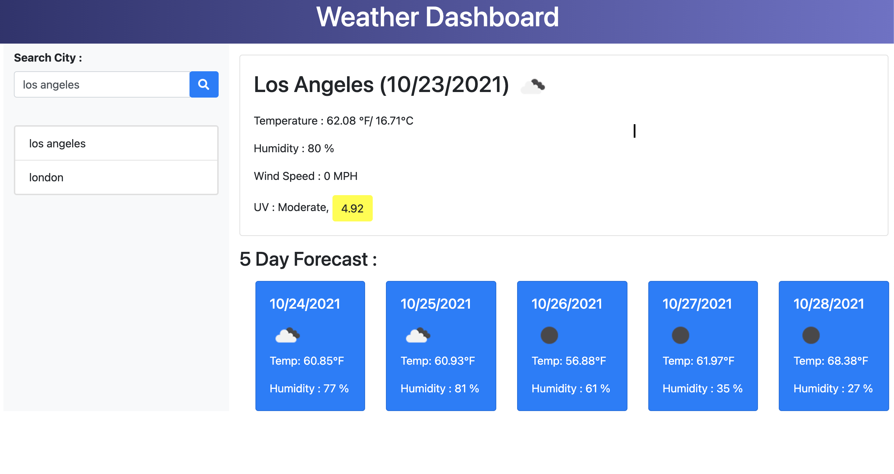

# Weather-Dashboard

# Description :

A weather app. that allows the user to check current weather and 5-day forecast by searching city name.

## Deployed Website :

[Weather Dashboard](/)

# Table of Contents

- [Demo](#demo)
- [Technology](#technology)

# Demo :

# Technology :

#### [OpenWeatherMap API](https://openweathermap.org/) :

- Access current weather data from major cities around the globe!

- API's used :
  - [Current Weather Data](https://openweathermap.org/current)
  - [5 day / 3 hour Forecast](https://openweathermap.org/forecast5)
  - [UV Index](https://openweathermap.org/api/uvi)

## - [jQuery](https://jquery.com/) :

### - [Javascript](https://developer.mozilla.org/en-US/docs/Web/JavaScript) :

### - [Bootstrap](https://getbootstrap.com/) :
